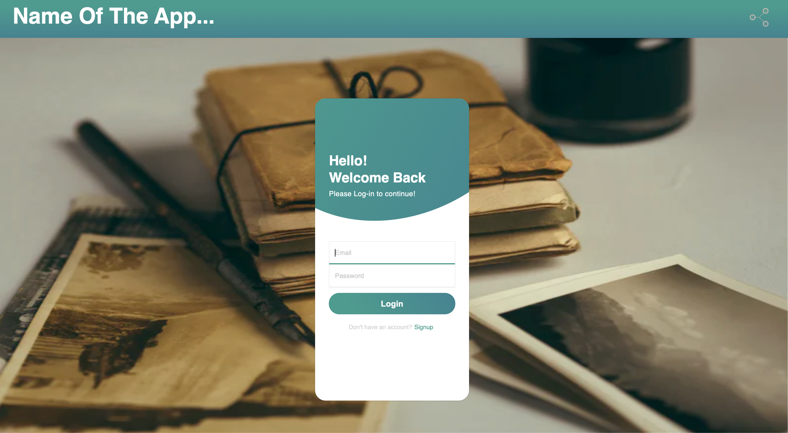
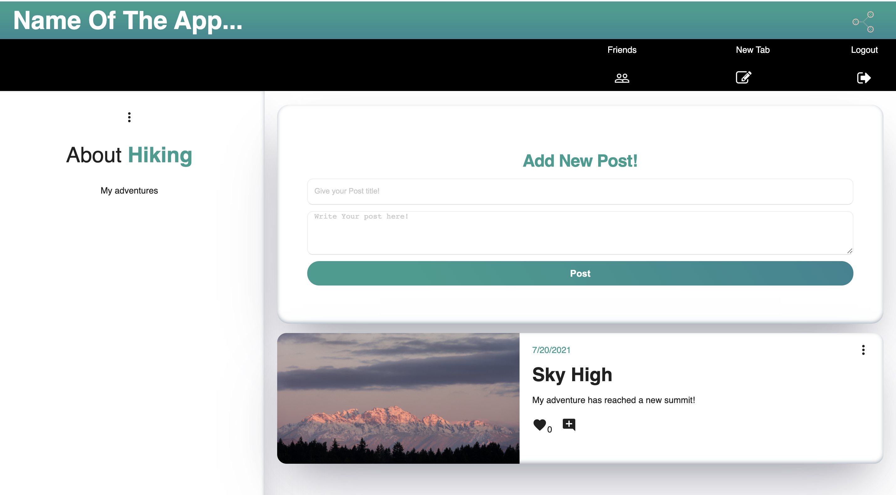
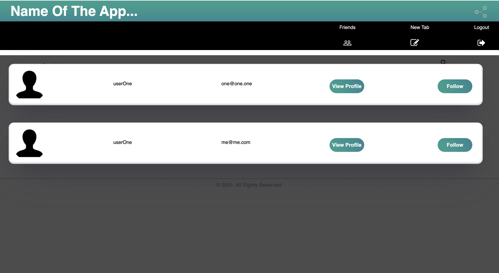

#       ME-MOIRS

#       License 

#       Description:

This application was developed for the user to be able to share interests and life-events with friends accross the app.

#       Table of Contents 

# [License](#License)

# [How-to-use](#How-to-use)

# [Link-to-deployed-application](#Link-to-deployed-application)

# [Technologies](#Technologies)

# [Contributors](#Contributors)

# [Screenshot-to-deployed-application](#Screenshot-to-deployed-application)

# [Possible-future-add-ons](#Possible-future-add-ons)

#        How-to-use  

Afer navigating to the application site, new users are prompted to create a username and password. Existing users can simply login. Once logged in, the user is then directred to the profile page. The profile page allows the option for the user to upload their profile and backound images to further customize their experience while using the app. Located in the navbar are some features that provide the user with the ability to create new tab titles, see previously created tab titles, find and follow friends, or logout. When the user clicks on an existing tab title, they will be redirected to a page where they can see all of their posts, images, and details relevant to that tab title. This post page also allows the user to create new posts that they wish to share. Each post has the option to receive likes and comments from fellow friends and followers. The user also has the option to find other friends, view their profile content, and choose to follow one onther's specifc content and interests.

#       Link-to-deployed-application

[https://protected-basin-89410.herokuapp.com/](https://protected-basin-89410.herokuapp.com/)

#       Technologies

* Axios
* Bcryptjs
* Express
* Express-Sessions
* Express-Validator
* Framer-Motion
* Ityped
* Mongoose
* Node.js
* React
* React-Moving-Text
* React-Router-Dom
* React-Multi-Carousel
* React-MDL
* Styled-Components

#       Contributors

* [Asia-Alnahi](https://github.com/asia-codeing)
* [Ben-Harris](https://github.com/harben31)
* [Cassandra-Cunningham](https://github.com/cmcunningham27)
* [Marisa-Hanna](https://github.com/MarisaHanna)

#      Screenshot-to-deployed-application

#       Possible-future-add-ons
